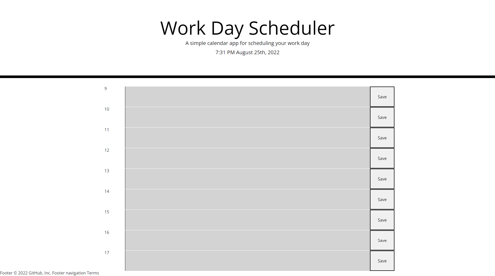

# Daily-Planner
## Description
[Daily-Planner](https://darren-rogers.github.io/daily-planner/)
Daily planner of business hours of the current day.  Input can be added to middle row that is saved to local storage and will remain on page refresh.  During the day, hours that have already passed are colored grey, the current hour is colored red and future hours are colored green. To clear an activity from the planner, right click and inspect the page, click the arrows dropdown and select application. Under the local storage select the file and clear all in local storage.
## Visual

## Usage
This planner can be used daily to help remember tasks or arrangements.
